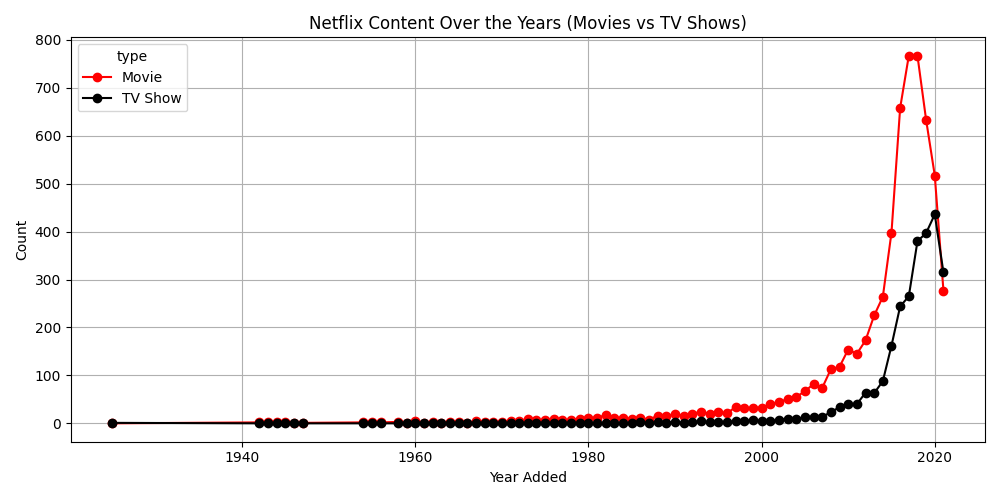
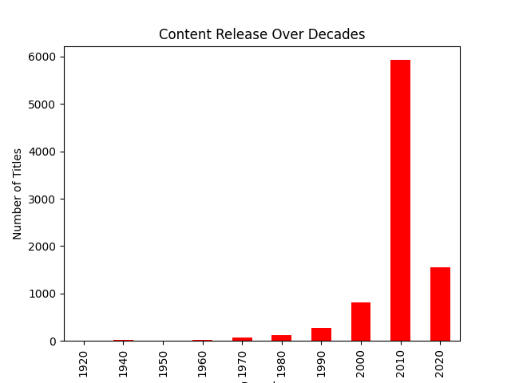
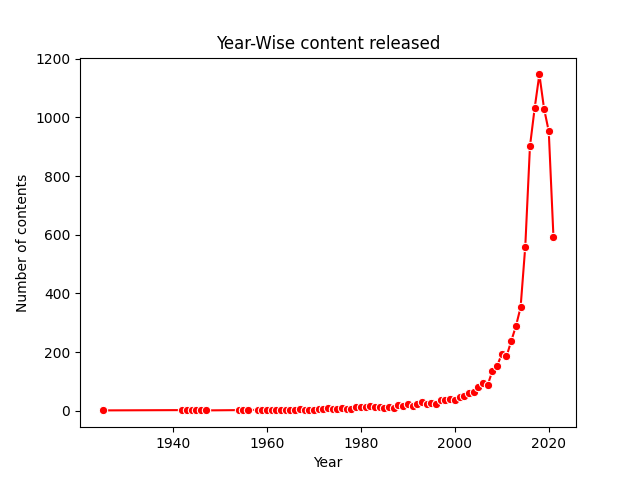

# 📺 Netflix Movies and TV Shows - Exploratory Data Analysis

A complete Exploratory Data Analysis (EDA) project on the **Netflix Movies and TV Shows** dataset using Python, Pandas, Matplotlib, and Seaborn. This project highlights trends in content type, genre, release year, actor appearances, and more.

---

## 🗂️ Dataset Source

- **Name**: Netflix Movies and TV Shows
- **Source**: [Kaggle - Shivamb/netflix-shows](https://www.kaggle.com/datasets/shivamb/netflix-shows)
- **Records**: 8,000+ titles
- **Features**: Title, Cast, Director, Release Year, Country, Genre, Type, etc.

---

## 🧰 Tools & Libraries Used

- Python
- pandas
- numpy
- matplotlib
- seaborn
- Jupyter Notebook

---

## 🔍 EDA Objectives

- Understand Netflix’s content composition.
- Analyze trends by **year**, **type**, **genre**, and **country**.
- Identify **most frequent actors** and **top genres**.
- Clean and transform raw data for analysis.

---

## 📊 Key Steps in Analysis

### 🔄 Data Cleaning
- Removed duplicate records
- Converted `date_added` column to datetime format
- Handled missing values

### 📈 Insights Visualized

1. **Content Type Distribution**  
   Movies dominate the platform compared to TV Shows.

2. **Titles Released Per Year**  
   Major spike in content between 2015–2019. Slight drop after 2020.

3. **Top Genres**  
   Most common genres: *Dramas*, *International Movies*, and *Comedies*.

4. **Top Countries**  
   United States leads in production, followed by India and the UK.

5. **Frequent Actors**  
   Indian actors like Anupam Kher and Shah Rukh Khan appear frequently.

6. **Growth of Movies vs. TV Shows**  
   Both grew sharply after 2015; growth slowed after 2020.

7. **Content Distribution Over Decades**  
   Most content released in the 2010s, a drop in the 2020s.

---

## 📌 Sample Visualizations

---

## 💡 Conclusion

This project offered great insights into Netflix’s content strategy and evolving trends. By cleaning and exploring real-world data, we:
- Practiced data wrangling and visualization
- Gained insights into content preferences over time
- Enhanced our ability to present findings clearly

---

## ✅ Future Improvements

- Build a dashboard using Plotly or Streamlit
- Predict content popularity using ML
- Deep-dive into genre-specific content patterns

---

## 🤝 Let's Connect

- 🔗 [LinkedIn](https://www.linkedin.com/in/sanjana-rawal)    
- ✉️ sanjana.rawal2006@gmail.com  

---

